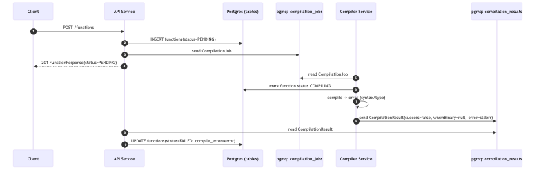
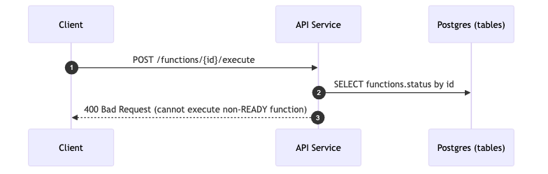

# Table of Contents

1.  [Overview](#org46c97fc)
2.  [Pnil](#org7646d95)
    1.  [Tech Stack](#orgf50f218)
        1.  [Code](#org6b9d195)
        2.  [DataBase](#org30e65ae)
        3.  [Message Queue](#org192a059)
        4.  [Migrations](#orgc65a5fd)
        5.  [Infra](#org18d7538)
3.  [Arch](#orgf0d507b)
4.  [Entities](#org506dfa7)
5.  [User Stories](#orge37d741)
6.  [Appendix](#org6930740)
    1.  [System Flows](#orgc1e4513)
        1.  [Legend](#org8c8f885)
        2.  [Flow 1: Register Function (Compilation Succeeds)](#orgbcc7638)
        3.  [Flow 2: Register Function (Compilation Fails)](#orge5c7475)
        4.  [Flow 3: Execute Function (Success)](#org5697953)
        5.  [Flow 4: Execute Function (Rejected - Not Ready)](#orgaefc4a3)
        6.  [Flow 5: Execute Function (Runtime Failure)](#orga6c2a49)
        7.  [Flow 6: Queue Redelivery / Retries](#org0581f8a)
        8.  [Compiler Service Flow](#org4734907)

# Overview

showcase for projectnil : a rudimentary function as a service written in Java, employing wasm

# Pnil

## Tech Stack

### Code

-   Java 25, Spring Boot
-   Chicory Wasm Runtime

### DataBase

-   Postgres 18

### Message Queue

-   pgmq 1.8

### Migrations

-   liquibase

### Infra

-   ansible
-   podman
-   scp&rsquo;ing tarballs

# Arch

# Entities

-   Functions
-   Executions

# User Stories

-   CRD over Function
    -   C on Function     ->  registering a function
    -   R over Function   ->  polling to check status
-   CRD over Execution     
    -   C on exec         ->  running a Function
    -   R over Execution  ->  checking past runs

# Appendix

## System Flows

### Legend

-   API = API Service
-   DB = PostgreSQL tables
-   Q = pgmq queues
-   CS = Compiler Service
-   WR = WASM Runtime

### Flow 1: Register Function (Compilation Succeeds)

### Flow 2: Register Function (Compilation Fails)

### Flow 3: Execute Function (Success)

****Precondition****: \`Function.status ``= READY` and `Function.wasmBinary !`` null\`

&#x2014;

### Flow 4: Execute Function (Rejected - Not Ready)

### Flow 5: Execute Function (Runtime Failure)

Examples of runtime failures:

-   WASM trap (e.g., unreachable instruction)
-   Invalid ABI export
-   Invalid JSON encoding in output

****Note****: Runtime failures return HTTP \`200\` because the platform operated correctly; the failure is in the user&rsquo;s function.

### Flow 6: Queue Redelivery / Retries

### Compiler Service Flow

1.  Runtime Flow

    1.  ****Startup****: Load configuration, establish pgmq connection, verify queues exist
    2.  ****Job Consumption****: Poll \`compilationjobs\` with visibility timeout
    3.  ****Language Filtering****: Process only jobs matching supported language; archive others
    4.  ****Compilation****: 
        -   Write source to temp file
        -   Execute \`asc <file> &#x2013;binaryFile <output>.wasm &#x2013;exportRuntime &#x2013;runtime incremental &#x2013;optimize\`
        -   Capture stdout/stderr
    5.  ****Result Publishing****:
        -   Success: Base64-encode WASM, publish with \`success=true\`
        -   Failure: Publish with \`success=false\` and error message
    6.  ****Cleanup****: Remove temp files, delete/archive queue message

2.  Error Handling

    <table border="2" cellspacing="0" cellpadding="6" rules="groups" frame="hsides">
    
    
    <colgroup>
    <col  class="org-left" />
    
    <col  class="org-left" />
    </colgroup>
    <thead>
    <tr>
    <th scope="col" class="org-left">Error Type</th>
    <th scope="col" class="org-left">Action</th>
    </tr>
    </thead>
    <tbody>
    <tr>
    <td class="org-left">Compilation failure (user code)</td>
    <td class="org-left">Publish `success=false`, archive message</td>
    </tr>
    
    <tr>
    <td class="org-left">Transient infrastructure failure</td>
    <td class="org-left">Allow message to reappear via visibility timeout</td>
    </tr>
    
    <tr>
    <td class="org-left">Fatal error (DB unavailable)</td>
    <td class="org-left">Exit process, let orchestrator restart</td>
    </tr>
    </tbody>
    </table>
