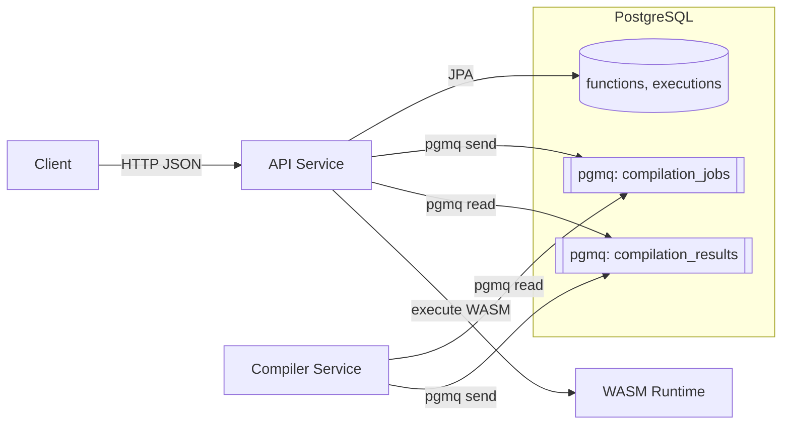

# ProjectNIL

A Function as a Service (FaaS) platform. Users submit source code, it compiles to WebAssembly, and executes on demand in a sandboxed environment.

[](https://github.com/nilenso/raj-onboarding/actions/workflows/integrations.yml)
[](https://github.com/nilenso/raj-onboarding/actions/workflows/deployment.yml)

| Metric | Status |
|--------|--------|
| **Phase** | Phase 0 Complete |
| **Tests** | 64 passing (6 common, 48 API, 10 compiler) |
| **API Endpoints** | 9 implemented |
| **Languages** | AssemblyScript |

## Quick Start

```bash
# Start the stack
cd projectNIL/infra
podman compose up -d postgres
podman compose --profile migrate up liquibase
podman compose --profile full up -d

# Register a function
curl -X POST http://localhost:8080/functions \
  -H "Content-Type: application/json" \
  -d '{
    "name": "echo",
    "language": "assemblyscript",
    "source": "export function handle(input: string): string { return input; }"
  }'

# Execute it (after status becomes READY)
curl -X POST http://localhost:8080/functions/{id}/execute \
  -H "Content-Type: application/json" \
  -d '{"input": {"message": "hello"}}'
```

See [Getting Started](guides/getting-started.md) for detailed setup.

## Architecture



## Services

| Service | Tech | Port | Purpose |
|---------|------|------|---------|
| api | Spring Boot 4.0 / Java 25 | 8080 | REST API, DB, WASM execution |
| compiler | Java 25 / Node.js | 8081 | Compile AssemblyScript to WASM |
| postgres | PostgreSQL 18 + pgmq | 5432 | Persistence + message queue |

## Documentation

### User Guides
- [Getting Started](guides/getting-started.md) - First function in 5 minutes
- [Writing Functions](guides/writing-functions.md) - AssemblyScript function guide

### Reference
- [API Reference](api.md) - Complete endpoint documentation

### Architecture
- [Overview](architecture/overview.md) - System components and tech stack
- [Domain Entities](architecture/entities.md) - Entity definitions and state machines
- [System Flows](architecture/flows.md) - End-to-end sequence diagrams

### Operations
- [Infrastructure](infrastructure.md) - Deployment and ops
- [Testing](testing-strategy.md) - Testing approach
- [Troubleshooting](troubleshooting.md) - Common issues

### Development
- [Contributing](development/contributing.md) - Build commands, branching, commits
- [Coding Standards](development/coding-standards.md) - Java conventions
- [Workflow](development/workflow.md) - GitHub Projects, Kanban

### Decisions
- [ADR-001: WASM Runtime](decisions/001-wasm-runtime.md) - Why Chicory
- [ADR-002: Message Queue](decisions/002-message-queue-pgmq.md) - Why pgmq

### Project
- [Roadmap](roadmap.md) - Phase 0/1/2 plans
