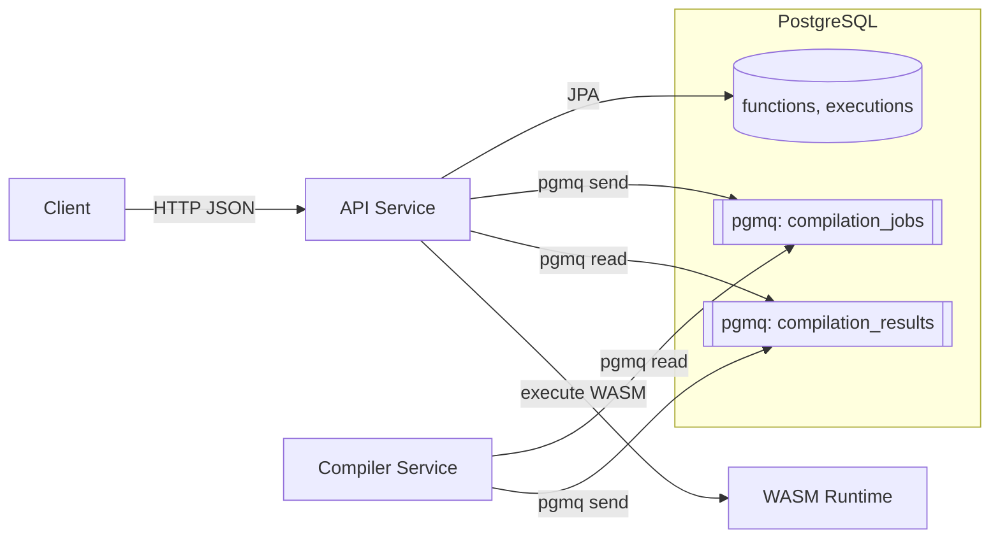

# ProjectNIL

[](https://github.com/nilenso/raj-onboarding/actions/workflows/integrations.yml)
[](https://github.com/nilenso/raj-onboarding/actions/workflows/deployment.yml)

A Function as a Service (FaaS) platform. Users submit source code, it compiles to WebAssembly, and executes on demand in a sandboxed environment.

| Metric | Status |
|--------|--------|
| **Phase** | Phase 0 Complete |
| **Tests** | 64 passing (6 common, 48 API, 10 compiler) |
| **API Endpoints** | 9 implemented |
| **Languages** | AssemblyScript |

> **Note:** `projectNIL/scope/` is the canonical specification. This doc summarizes the system and focuses on operational context.

## Quick Links

- **[Getting Started Guide](./guides/getting-started.md)** - Set up and run your first function
- **[Writing Functions Guide](./guides/writing-functions.md)** - Learn how to write AssemblyScript functions
- **[API Reference](./api.md)** - Complete endpoint documentation
- **[Canonical Contracts](https://github.com/nilenso/raj-onboarding/blob/main/projectNIL/scope/contracts.md)** - Authoritative API and queue contracts

## Architecture



See the [scope/architecture.md](https://github.com/nilenso/raj-onboarding/blob/main/projectNIL/scope/architecture.md) for the canonical architecture specification.

## Services

| Service | Tech | Port | Purpose |
|---------|------|------|---------|
| api | Spring Boot 4.0 / Java 25 | 8080 | REST API, DB, WASM execution |
| compiler | Java 25 / Node.js | 8081 | Compile AssemblyScript to WASM |
| postgres | PostgreSQL 18 + pgmq | 5432 | Persistence + message queue |

## Local Development

### Prerequisites

- [Podman](https://podman.io/) (or Docker)
- [Podman Compose](https://github.com/containers/podman-compose) (or Docker Compose)
- Java 25+ (for running services locally)

### Quick Start

```bash
cd projectNIL/infra

# Start PostgreSQL with pgmq
podman compose up -d postgres

# Run database migrations
podman compose --profile migrate up liquibase

# Verify setup
podman exec projectnil-db psql -U projectnil -d projectnil -c "\dt"
```

### Running the Full Stack

```bash
cd projectNIL/infra

# Start postgres and run migrations
podman compose up -d postgres
podman compose --profile migrate up liquibase

# Build and start compiler service
podman compose --profile full up -d compiler

# Start API service (from projectNIL root)
cd ..
./gradlew :services:api:bootRun
```

### Common Commands

```bash
# View logs
podman compose logs -f postgres
podman compose logs -f compiler

# Stop all services
podman compose --profile full down

# Reset database (destroy all data)
podman compose --profile full down -v

# Connect to database
podman exec -it projectnil-db psql -U projectnil -d projectnil

# Run tests
./gradlew test                    # All tests
./gradlew :services:api:test      # API tests only
./gradlew :services:compiler:test # Compiler tests only
```

## Tech Stack

| Component | Technology | Version |
|-----------|------------|---------|
| Language | Java | 25 |
| Framework | Spring Boot | 4.0.0 |
| Database | PostgreSQL | 18 |
| Message Queue | pgmq | 1.8.0 |
| WASM Runtime | Chicory | 1.6.1 |
| Migrations | Liquibase | 4.30 |
| Compiler | AssemblyScript | Latest |
| Containers | Podman Compose | - |

See [stack.md](./stack.md) for rationale.

## Project Structure

```
projectNIL/
├── common/                    # Shared domain objects
│   └── src/main/java/.../domain/
│       ├── Function.java
│       ├── Execution.java
│       └── queue/             # CompilationJob, CompilationResult
│
├── services/
│   ├── api/                   # Spring Boot API service
│   │   └── src/main/java/.../
│   │       ├── web/           # Controllers, DTOs
│   │       ├── service/       # Business logic
│   │       ├── repository/    # JPA repositories
│   │       ├── runtime/       # WASM execution
│   │       └── messaging/     # PGMQ integration
│   │
│   └── compiler/              # AssemblyScript compiler
│       └── src/main/java/.../
│           ├── core/          # Compilation logic
│           └── messaging/     # PGMQ integration
│
├── infra/                     # Infrastructure
│   ├── compose.yml            # Local development
│   └── migrations/            # Liquibase changelogs
│
├── docs/                      # Documentation
│   ├── guides/                # User guides
│   ├── api.md                 # API reference
│   └── decisions/             # ADRs
│
└── scope/                     # Canonical specifications
    ├── contracts.md           # API & queue contracts
    ├── entities.md            # Domain entities
    └── flows.md               # Sequence diagrams
```

## Documentation Index

### User Guides
- [Getting Started](./guides/getting-started.md) - First function in 5 minutes
- [Writing Functions](./guides/writing-functions.md) - AssemblyScript function guide

### Reference
- [API Reference](./api.md) - Complete endpoint documentation
- [WASM Runtime](./wasm-runtime.md) - Chicory runtime details
- [Compiler Service](./compiler.md) - Compilation pipeline
- [Infrastructure](./infrastructure.md) - Deployment and ops

### Specifications (GitHub)
- [Canonical Contracts](https://github.com/nilenso/raj-onboarding/blob/main/projectNIL/scope/contracts.md) - Source of truth for APIs
- [Domain Entities](https://github.com/nilenso/raj-onboarding/blob/main/projectNIL/scope/entities.md) - Entity definitions and state machines
- [System Flows](https://github.com/nilenso/raj-onboarding/blob/main/projectNIL/scope/flows.md) - End-to-end sequences
- [AGENTS.md](https://github.com/nilenso/raj-onboarding/blob/main/projectNIL/AGENTS.md) - Coding conventions

### Project
- [Roadmap](./roadmap.md) - Phase 0/1/2 plans
- [Session Handoff](./session-handoff.md) - Current implementation status
- [Design: API Service](./design-api-service.md) - Implementation blueprint

### Architecture Decisions
- [ADR-001: WASM Runtime](./decisions/001-wasm-runtime.md) - Why Chicory
- [ADR-002: Message Queue](./decisions/002-message-queue-pgmq.md) - Why pgmq
