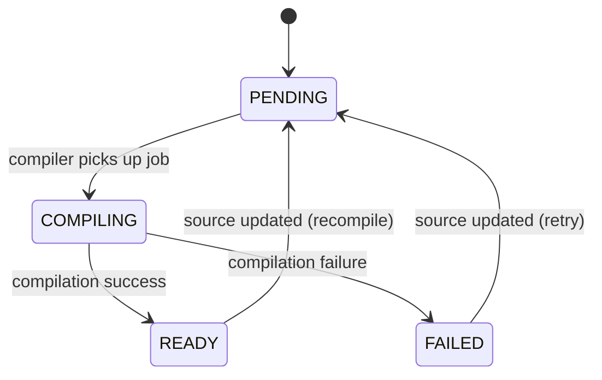
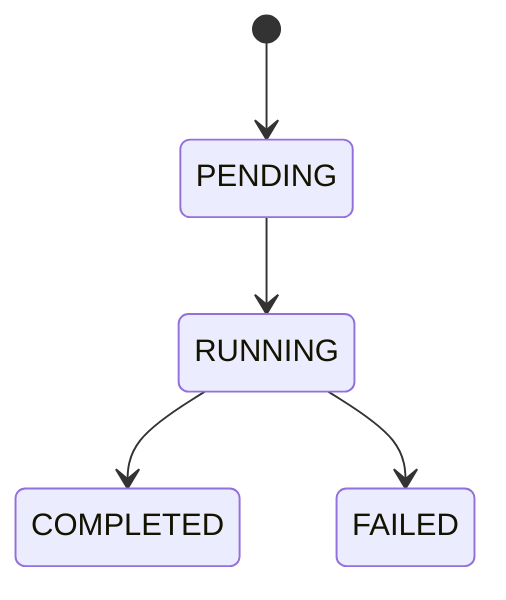

# Domain Entities

This document defines the domain entities, their persistence shape, and their state machines.

## Entity: Function

### Purpose

Represents user-submitted source code and its compiled WASM artifact.

### Fields

| Field | Type | Description |
|-------|------|-------------|
| `id` | UUID | Primary key |
| `name` | string | User-provided name |
| `description` | string? | Optional description |
| `language` | string | Source language (e.g., `"assemblyscript"`) |
| `source` | string | Source code text |
| `wasmBinary` | bytes? | Compiled WASM binary |
| `status` | FunctionStatus | Current lifecycle state |
| `compileError` | string? | Compilation error message |
| `createdAt` | timestamp | Creation time |
| `updatedAt` | timestamp | Last modification time |

### Persistence

- **Table**: `functions`
- **WASM storage**: `wasm_binary` column (`BYTEA`)

### Status: FunctionStatus

| Status | Description |
|--------|-------------|
| `PENDING` | Accepted by API, awaiting validation and job publication |
| `COMPILING` | Job published to `compilation_jobs`, awaiting compiler result |
| `READY` | Compilation succeeded, `wasmBinary` persisted |
| `FAILED` | Compilation failed, `compileError` populated |

### State Machine

**Note**: The transition from `PENDING` to `COMPILING` occurs when the Compiler Service picks up the job, not when the API publishes it.

### Invariants

- When `status == READY`, `wasmBinary` MUST be non-null
- When `status == FAILED`, `compileError` MUST be non-null

---

## Entity: Execution

### Purpose

Represents a single invocation attempt of a function.

### Fields

| Field | Type | Description |
|-------|------|-------------|
| `id` | UUID | Primary key |
| `functionId` | UUID | Reference to parent function |
| `input` | JSON? | Execution input |
| `output` | JSON? | Execution output |
| `status` | ExecutionStatus | Current lifecycle state |
| `errorMessage` | string? | Runtime error message |
| `startedAt` | timestamp? | Execution start time |
| `completedAt` | timestamp? | Execution completion time |
| `createdAt` | timestamp | Record creation time |

### Persistence

- **Table**: `executions`
- **Input/Output**: Stored as `JSONB` columns

### Status: ExecutionStatus

| Status | Description |
|--------|-------------|
| `PENDING` | Accepted by API (optional intermediate state) |
| `RUNNING` | Execution in progress |
| `COMPLETED` | Execution succeeded, `output` present |
| `FAILED` | Execution failed, `errorMessage` present |

### State Machine

### Invariants

- When `status == COMPLETED`, `output` SHOULD be non-null and `errorMessage` MUST be null
- When `status == FAILED`, `errorMessage` MUST be non-null

---

## Relationships

- `Execution.functionId` references `Function.id` (foreign key)
- Deleting a function cascades to its executions

## Database Migrations

Schema is managed via Liquibase changelogs:

- `infra/migrations/changelog/001-create-functions-table.yaml`
- `infra/migrations/changelog/002-create-executions-table.yaml`
- `infra/migrations/changelog/003-setup-pgmq-queues.yaml`
