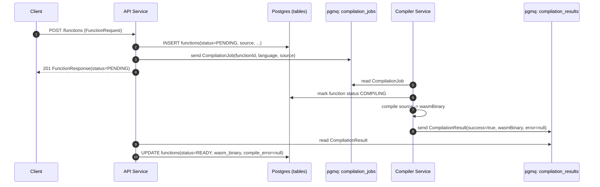
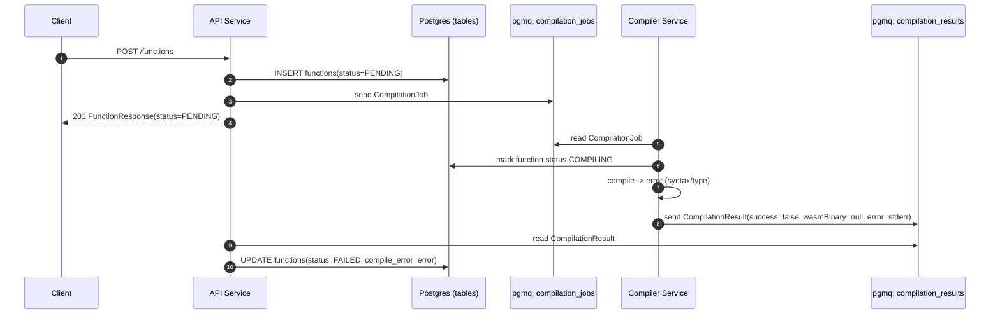
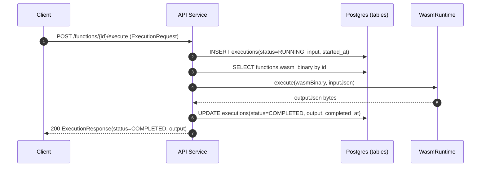
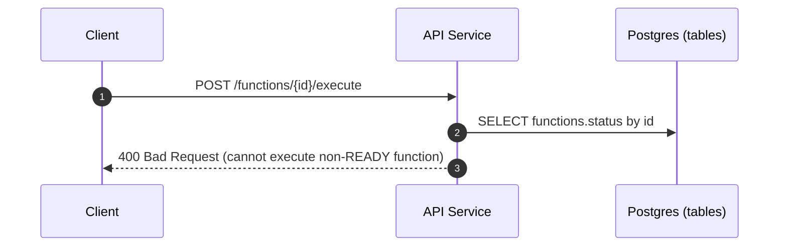
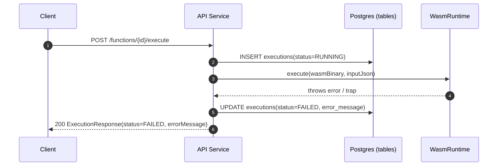
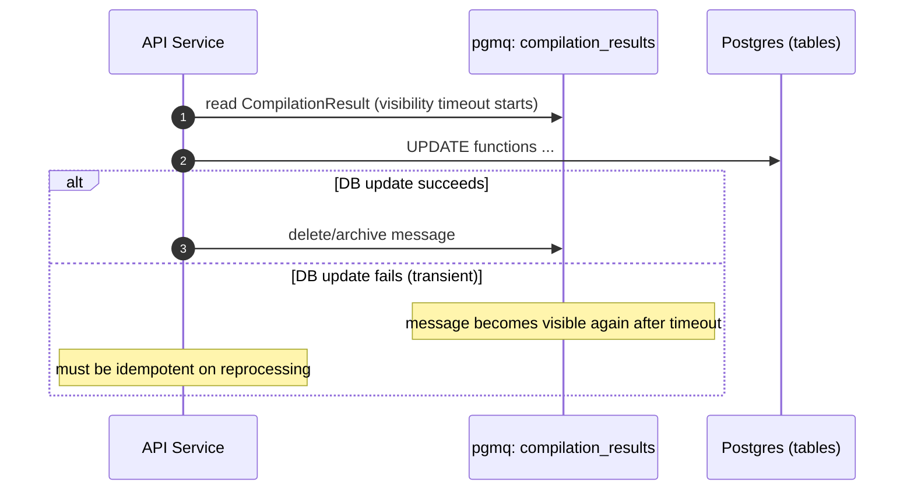

# System Flows

This document describes end-to-end flows across services, including success and failure paths.

## Legend

- **API** = API Service
- **DB** = PostgreSQL tables
- **Q** = pgmq queues
- **CS** = Compiler Service
- **WR** = WASM Runtime

---

## Flow 1: Register Function (Compilation Succeeds)



---

## Flow 2: Register Function (Compilation Fails)



---

## Flow 3: Execute Function (Success)

**Precondition**: `Function.status == READY` and `Function.wasmBinary != null`



---

## Flow 4: Execute Function (Rejected - Not Ready)



---

## Flow 5: Execute Function (Runtime Failure)

Examples of runtime failures:
- WASM trap (e.g., unreachable instruction)
- Invalid ABI export
- Invalid JSON encoding in output



**Note**: Runtime failures return HTTP `200` because the platform operated correctly; the failure is in the user's function.

---

## Flow 6: Queue Redelivery / Retries

This flow describes message reprocessing when persistence fails.



---

## WASM Runtime Execution Details

### High-Level Flow

```
┌─────────────────┐     ┌──────────────────┐     ┌─────────────────┐
│  Java Host      │     │  WASM Linear     │     │  AS Function    │
│  (API Service)  │     │  Memory          │     │  (handle)       │
└────────┬────────┘     └────────┬─────────┘     └────────┬────────┘
         │                       │                        │
         │ 1. Write JSON input   │                        │
         │──────────────────────>│                        │
         │                       │                        │
         │ 2. Call handle(ptr)   │                        │
         │───────────────────────────────────────────────>│
         │                       │                        │
         │                       │    3. Process & return │
         │<───────────────────────────────────────────────│
         │                       │                        │
         │ 4. Read JSON output   │                        │
         │<──────────────────────│                        │
```

### AssemblyScript Memory Model

AssemblyScript compiles `handle(string): string` to WASM as `handle(i32) -> i32` where arguments are pointers to memory.

**String Layout**:
```
┌─────────────────────────────────────────────────────────────┐
│  20-byte header (GC metadata)  │  UTF-16LE payload          │
├────────────────────────────────┼─────────────────────────────┤
│  ... | rtId (4B) | rtSize (4B) │  string data (rtSize bytes) │
└────────────────────────────────┴─────────────────────────────┘
         offset -8    offset -4    offset 0 (pointer location)
```

### Required Module Exports

AssemblyScript modules compiled with `--exportRuntime` must export:

| Export | Signature | Purpose |
|--------|-----------|---------|
| `__new` | `(size: i32, id: i32) -> i32` | Allocate managed object |
| `__pin` | `(ptr: i32) -> i32` | Pin object (prevent GC) |
| `__unpin` | `(ptr: i32) -> void` | Unpin object (allow GC) |
| `handle` | `(ptr: i32) -> i32` | User function |
| `memory` | (export) | Linear memory |

### Memory Management Flow

1. **Allocate**: Call `__new(byteLength, STRING_CLASS_ID)` to allocate
2. **Pin**: Call `__pin(ptr)` to prevent GC during execution
3. **Write**: Copy UTF-16LE bytes to memory at pointer
4. **Execute**: Call `handle(inputPtr)` → get `outputPtr`
5. **Read**: Read `rtSize` from `outputPtr - 4`, read UTF-16LE bytes
6. **Cleanup**: Call `__unpin(inputPtr)` to allow GC

---

## Compiler Service Flow

### Runtime Flow

1. **Startup**: Load configuration, establish pgmq connection, verify queues exist
2. **Job Consumption**: Poll `compilation_jobs` with visibility timeout
3. **Language Filtering**: Process only jobs matching supported language; archive others
4. **Compilation**: 
   - Write source to temp file
   - Execute `asc <file> --binaryFile <output>.wasm --exportRuntime --runtime incremental --optimize`
   - Capture stdout/stderr
5. **Result Publishing**:
   - Success: Base64-encode WASM, publish with `success=true`
   - Failure: Publish with `success=false` and error message
6. **Cleanup**: Remove temp files, delete/archive queue message

### Error Handling

| Error Type | Action |
|------------|--------|
| Compilation failure (user code) | Publish `success=false`, archive message |
| Transient infrastructure failure | Allow message to reappear via visibility timeout |
| Fatal error (DB unavailable) | Exit process, let orchestrator restart |
