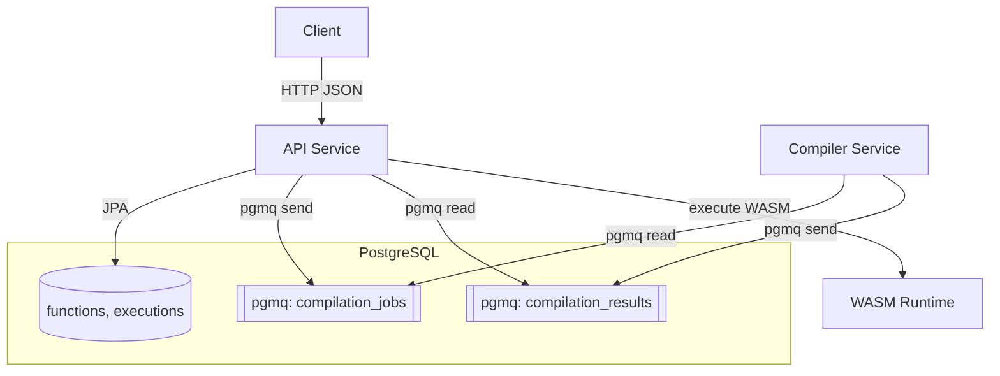

# Architecture Overview

ProjectNIL is a Function-as-a-Service (FaaS) platform where users submit source code, the platform compiles it to WebAssembly (WASM) asynchronously, and users execute the compiled function on demand with JSON input/output.

## System Components

| Component | Technology | Responsibility |
|-----------|------------|----------------|
| **API Service** | Spring Boot / Java 25 | REST interface, persistence, orchestration, WASM execution |
| **Compiler Service** | Spring Boot / Java 25 + Node.js | Consumes compilation jobs, compiles source to WASM |
| **PostgreSQL** | PostgreSQL 18 + pgmq 1.8.0 | Persistent tables (`functions`, `executions`) and message queues |
| **WASM Runtime** | Chicory 1.6.1 | Pure Java WebAssembly execution within API service |

## Deployment View

## Service Responsibilities

### API Service

- Owns the REST API contract (9 endpoints)
- Persists `Function` entities (source, status, WASM binary, compile errors)
- Persists `Execution` entities (inputs/outputs, status, runtime errors)
- Publishes `CompilationJob` messages to the queue
- Consumes `CompilationResult` messages from the queue
- Executes compiled WASM via the Chicory runtime

### Compiler Service

- Consumes `CompilationJob` messages from `compilation_jobs` queue
- Compiles source based on `language` field (currently: AssemblyScript)
- Publishes `CompilationResult` messages to `compilation_results` queue
- Safe to run concurrently; multiple compiler instances can co-exist
- Marks function status as `COMPILING` when job is picked up

### PostgreSQL + pgmq

- Stores platform state in relational tables
- Provides durable message queues for asynchronous compilation
- ACID guarantees for both data and messaging

## Technology Stack

### Core Runtime

| Component | Version | Rationale |
|-----------|---------|-----------|
| Java | 25 | Latest features, structured concurrency, virtual threads |
| Spring Boot | 4.0.0 | First-class Java 25 support, modularization |
| Gradle | 8.x | Multi-project build support |

### Data & Messaging

| Component | Version | Rationale |
|-----------|---------|-----------|
| PostgreSQL | 18 | Advanced JSONB support, robust extension ecosystem |
| pgmq | 1.8.0 | Postgres-native queuing, no additional infrastructure |
| Liquibase | 4.30 | Database-agnostic schema management |

### WebAssembly

| Component | Version | Rationale |
|-----------|---------|-----------|
| Chicory | 1.6.1 | Pure Java WASM runtime, no JNI overhead |
| AssemblyScript | Latest | TypeScript-like syntax, easy WASM onboarding |

### Infrastructure

| Component | Version | Rationale |
|-----------|---------|-----------|
| Podman | Latest | Daemon-less, rootless container runtime |
| Podman Compose | Latest | Local multi-container development |

For exact dependency versions, see `gradle/libs.versions.toml`.

## Cross-Cutting Concerns

### Correlation IDs

- `functionId` correlates compilation jobs and results
- `executionId` correlates runtime execution attempts

### Idempotency

Compilation result processing must be safe under message redelivery:
- If `success=true`: Set `status=READY`, store `wasmBinary`, clear `compileError`
- If `success=false`: Set `status=FAILED`, store `compileError`

### Failure Visibility

Failures are persisted on the owning entity:
- Compilation errors → `Function.compileError`
- Runtime errors → `Execution.errorMessage`

### Error Semantics

- Return `200` with `ExecutionResponse.status=FAILED` when the failure is produced by user code
- Return `5xx` only when the platform cannot record/update state (infrastructure failure)

### Security

WASM provides sandboxing boundaries. The platform enforces:
- Execution timeout (default: 10 seconds)
- ABI validation (required `handle` export)
- Memory monitoring (warning at 16MB)

## Non-Goals (Current Phase)

- Multi-tenant authentication/permissions
- Long-running/async executions
- External artifact storage (e.g., S3)
- Function versioning

See [Roadmap](../roadmap.md) for planned features.
