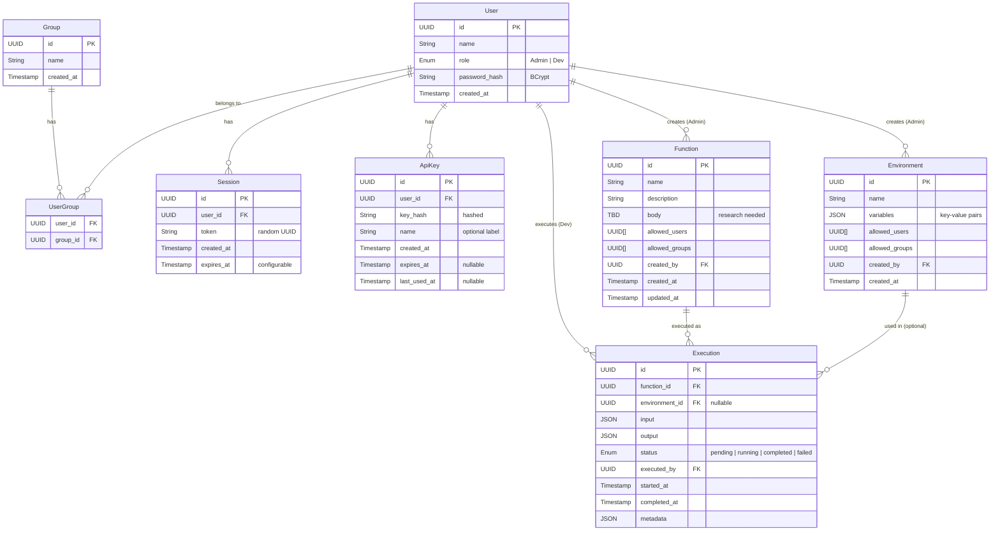

# Domain Model

> **[Work in Progress / Malleable]**: This document captures the overall domain model across all phases.
> For phase-specific implementation details, refer to the corresponding phase documents:
> - [Phase 0](./phase0.md) - Core FaaS without auth (current implementation)
> - Phase 1 - Auth + permissions (planned)
> - Phase 2 - Analytics (planned)
>
> This document will be finalized at project completion.

## Overview

ProjectNIL is a **Function as a Service (FaaS)** system that allows users to register, manage, and execute functions. The system supports:

- **Function registration** - Admins can register functions that can be executed later
- **Environment management** - Key-value stores that functions can access during execution
- **Execution tracking** - Records of function runs with inputs, outputs, and metadata
- **Access control** - Permission-based access to functions and environments (Phase 1)
- **Multiple auth methods** - Password-based sessions and API keys for programmatic access (Phase 1)

## Entities

### Group

Organizational unit for users.

| Attribute | Type | Description |
|-----------|------|-------------|
| `id` | UUID | Unique identifier |
| `name` | String | Group name |
| `created_at` | Timestamp | When created |

### User

A user of the system with a role.

| Attribute | Type | Description |
|-----------|------|-------------|
| `id` | UUID | Unique identifier |
| `name` | String | Display name |
| `role` | Enum | `Admin` or `Dev` |
| `password_hash` | String | BCrypt hash |
| `created_at` | Timestamp | When registered |

**Role Privileges:**
- **Admin**: Full CRUD on all entities (Group, User, Function, Environment, Execution)
- **Dev**: Execute functions using environments (read Function, read Environment, create/read Execution)

### UserGroup (Join Table)

Many-to-many relationship between User and Group.

| Attribute | Type | Description |
|-----------|------|-------------|
| `user_id` | FK → User | User reference |
| `group_id` | FK → Group | Group reference |

### Session

Stateful session tokens for interactive/browser use.

| Attribute | Type | Description |
|-----------|------|-------------|
| `id` | UUID | Unique identifier |
| `user_id` | FK → User | Who owns it |
| `token` | String | Random UUID |
| `created_at` | Timestamp | When created |
| `expires_at` | Timestamp | When it expires (configurable) |

### ApiKey

Programmatic access tokens for bots, CI/CD, scripts.

| Attribute | Type | Description |
|-----------|------|-------------|
| `id` | UUID | Unique identifier |
| `user_id` | FK → User | Who owns it |
| `key_hash` | String | Hashed key (raw shown only once at creation) |
| `name` | String | Optional label (e.g., "CI Bot") |
| `created_at` | Timestamp | When created |
| `expires_at` | Timestamp | Nullable (for non-expiring keys) |
| `last_used_at` | Timestamp | Nullable (for auditing) |

### Function

A registered function that can be executed.

| Attribute | Type | Description |
|-----------|------|-------------|
| `id` | UUID | Unique identifier |
| `name` | String | Human-readable name |
| `description` | String | What the function does |
| `body` | TBD | The actual implementation (see [toThink.md](./toThink.md)) |
| `allowed_users` | UUID[] | User IDs with access (empty = public) |
| `allowed_groups` | UUID[] | Group IDs with access (empty = public) |
| `created_by` | FK → User | Who registered it (Admin) |
| `created_at` | Timestamp | When registered |
| `updated_at` | Timestamp | Last modification |

### Environment

Key-value store that functions can access during execution.

| Attribute | Type | Description |
|-----------|------|-------------|
| `id` | UUID | Unique identifier |
| `name` | String | Human-readable name |
| `variables` | JSON | Key-value pairs |
| `allowed_users` | UUID[] | User IDs with access (empty = public) |
| `allowed_groups` | UUID[] | Group IDs with access (empty = public) |
| `created_by` | FK → User | Who created it (Admin) |
| `created_at` | Timestamp | When created |

### Execution

A record of a function run.

| Attribute | Type | Description |
|-----------|------|-------------|
| `id` | UUID | Unique identifier |
| `function_id` | FK → Function | Which function was executed |
| `environment_id` | FK → Environment | Which environment was used (nullable) |
| `input` | JSON | Input data provided |
| `output` | JSON | Output data returned |
| `status` | Enum | `pending`, `running`, `completed`, `failed` |
| `executed_by` | FK → User | Who triggered it (Dev) |
| `started_at` | Timestamp | Execution start |
| `completed_at` | Timestamp | Execution end (nullable) |
| `metadata` | JSON | Additional context (errors, logs, runtime stats) |

## Entity Relationship Diagram



## Access Control

Permissions are embedded on Function and Environment entities:

```
canAccess(user, resource):
  if user.role == Admin:
    return true
  if resource.allowed_users is empty AND resource.allowed_groups is empty:
    return true  # Public access
  return user.id in resource.allowed_users 
      OR any(group.id in resource.allowed_groups for group in user.groups)
```

## User Stories

### Phase 0 (No Auth)

| Story | Description |
|-------|-------------|
| Dev registers a function | After posting a registration request, devs can observe it in available functions |
| Dev executes a function | Dev executes a function with inputs, to retrieve outputs |
| Dev updates a function | Dev updates a function, to execute it later on |
| Dev deletes a function | Dev deletes a function, to deprecate older/unneeded functions |
| Dev reads available functions | Dev reads available functions, to fetch what could be executed |

### Phase 1 (Auth + Permissions)

| Story | Description |
|-------|-------------|
| Admin registers a Dev | Admin registers a Dev, to enable operations on Functions |
| Admin registers an Environment | Admin registers an environment, for Devs to use when executing functions |
| Admin retrieves Job histories | Admin retrieves Job histories for audits (with filters on state, devs, metadata) |

### Phase 2 (Analytics)

| Story | Description |
|-------|-------------|
| Dashboard for execution metrics | Analytics layer for execution times and metadata analysis (TBD) |

## Phases

| Phase | Entities | Description |
|-------|----------|-------------|
| 0 | Function, Environment, Execution | No auth, all access allowed |
| 1 | + User, Group, UserGroup, Session, ApiKey | Full auth + permissions |
| 2 | + Analytics layer | Dashboard for execution times, metadata analysis |
