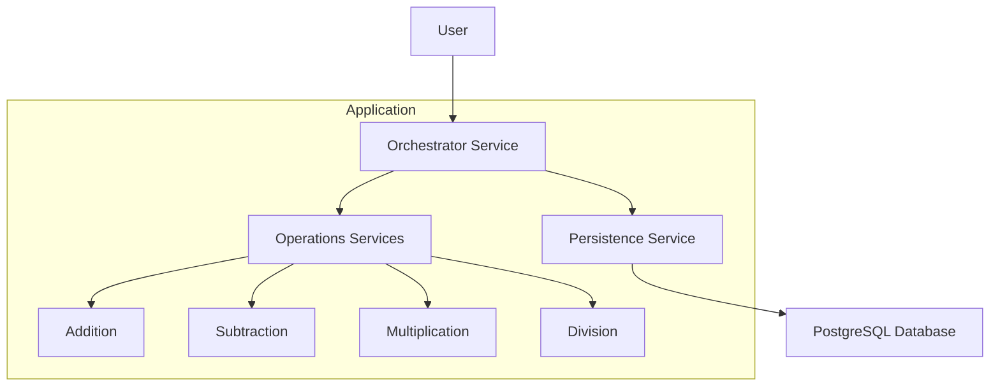

# Project NIL

 - towards a pedagogical CRUD to pick up on tooling and best practices

## Ideation Seed

 - shared calculator microservice cluster
 - CRUD on calculation jobs (logged in DB)
 - opportunity to introduce probabilistic delays and test out benchmarking and profiling ecosystem as well
 
## Scope & Phases (documentation in progress)

 - project management being done [here](progress.org)

### Arch



# Appendix

## init configs

```
gradle init \
  --type java-application \
  --dsl groovy \
  --package rnil.enso \
  --project-name ProjectNIL  \
  --no-split-project  \
  --no-incubating  \
  --java-version 25
```

## TechStack

 - Microservices : spring boot
 - Testing : JUnit, JBehave
 - Scope Documentation : Gherkin (Cucumber) 
 - Shared Calculation Log : Postgres 
