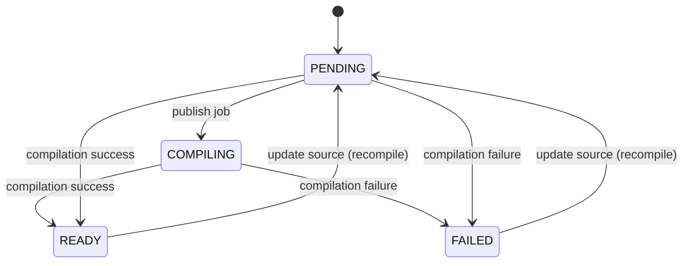
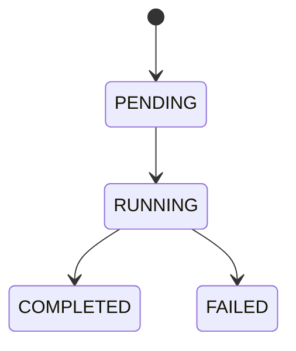

# Entities (Canonical)

This doc defines the **domain entities**, their persistence shape, and their state machines.

## Entity: `Function`

### Purpose
Represents user-submitted source code and its compiled WASM artifact.

### Canonical Fields
- `id: UUID`
- `name: string`
- `description: string?`
- `language: string` (e.g. `"assemblyscript"`)
- `source: string`
- `wasmBinary: bytes?`
- `status: FunctionStatus`
- `compileError: string?`
- `createdAt: timestamp`
- `updatedAt: timestamp`

### Persistence
- Table: `functions`
- WASM storage: `wasm_binary` (`BYTEA`)

### Status: `FunctionStatus`
- `PENDING`: accepted by API, job not yet processed.
- `COMPILING`: compilation started (optional intermediate; may be omitted in minimal impl).
- `READY`: compiled successfully, `wasmBinary` present.
- `FAILED`: compilation failed, `compileError` present.

### Function State Machine

### Invariants
- When `status == READY`, `wasmBinary` MUST be non-null.
- When `status == FAILED`, `compileError` MUST be non-null.

## Entity: `Execution`

### Purpose
Represents a single invocation attempt of a function.

### Canonical Fields
- `id: UUID`
- `functionId: UUID`
- `input: JSON?`
- `output: JSON?`
- `status: ExecutionStatus`
- `errorMessage: string?`
- `startedAt: timestamp?`
- `completedAt: timestamp?`
- `createdAt: timestamp`

### Persistence
- Table: `executions`
- Columns `input` and `output` stored as `JSONB`.

### Status: `ExecutionStatus`
- `PENDING`: accepted by API (optional intermediate).
- `RUNNING`: execution in progress.
- `COMPLETED`: execution succeeded, `output` present.
- `FAILED`: execution failed, `errorMessage` present.

### Execution State Machine

### Invariants
- When `status == COMPLETED`, `output` SHOULD be non-null and `errorMessage` MUST be null.
- When `status == FAILED`, `errorMessage` MUST be non-null.

## Relationships
- `Execution.functionId` references `Function.id` (FK).
- Deleting a function cascades to its executions.

## Source of Truth
- Database migrations:
  - `projectNIL/infra/migrations/changelog/001-create-functions-table.yaml`
  - `projectNIL/infra/migrations/changelog/002-create-executions-table.yaml`
  - `projectNIL/infra/migrations/changelog/003-setup-pgmq-queues.yaml`
