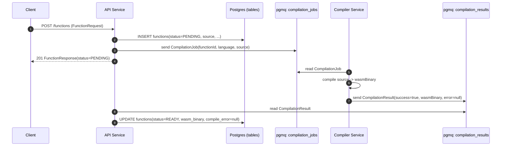
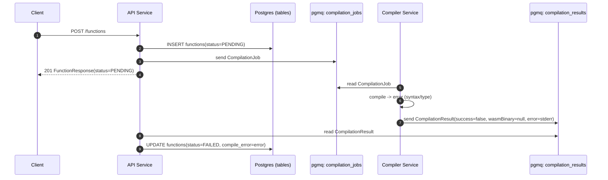
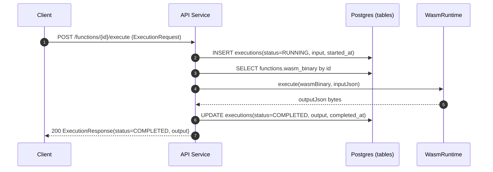
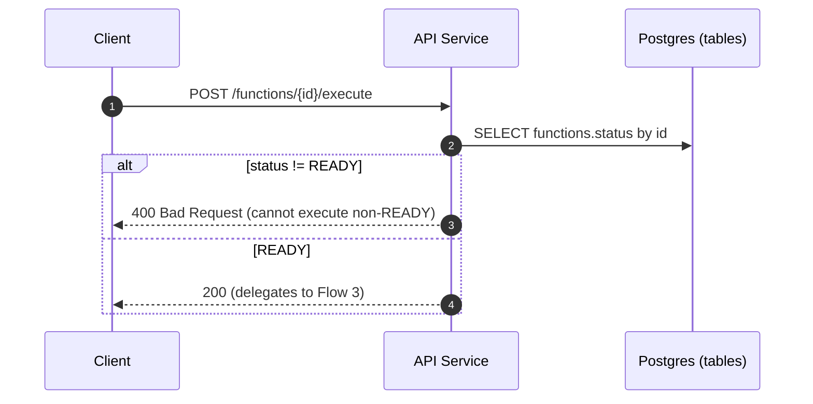
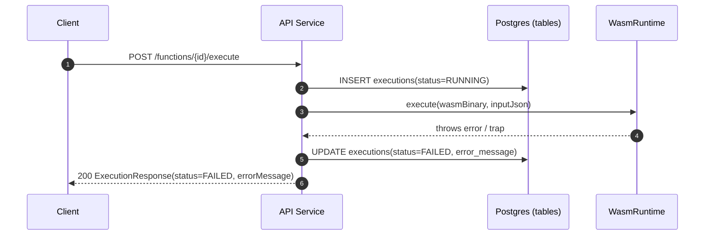
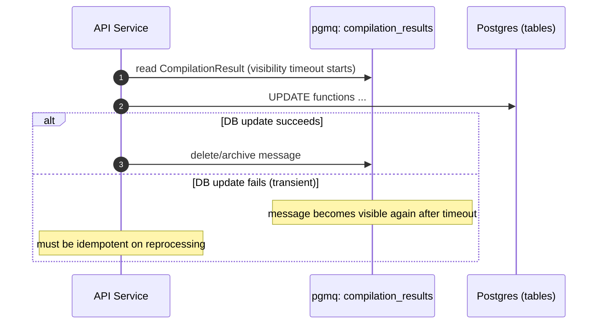

# End-to-End Flows (Canonical)

This doc describes end-to-end flows across services, including success and failure paths.

## Legend
- API = API service
- DB = Postgres tables
- Q = pgmq queues

## Flow 1: Register Function (Happy Path: compile succeeds)

## Flow 2: Register Function (Compile fails)

## Flow 3: Execute Function (Happy Path)

Precondition: `Function.status == READY` and `Function.wasmBinary != null`.

## Flow 4: Execute Function (Rejected: function not READY)

## Flow 5: Execute Function (Runtime failure)

Examples:
- WASM trap
- invalid ABI export
- invalid JSON encoding

## Flow 6: Queue Redelivery / Retries (Non-successful runs)

This flow describes what happens when processing fails mid-way.

## Observed Gaps to Converge (tracked in `scope/practices.md`)
- Define whether `execute` response for failures is `200` with `status=FAILED` vs an HTTP error.
- Decide if the API sets `Function.status=COMPILING` immediately after publishing job.
- Decide canonical shape of `ExecutionRequest.input` (JSON object vs JSON string).
